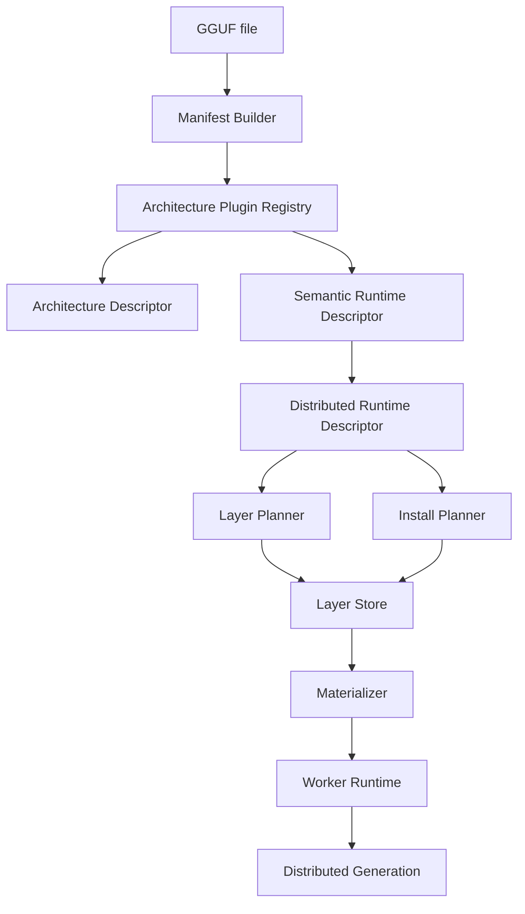

# Task 9.9 — Runtime Stabilization & Architecture Generalization

## Goal

Turn the distributed runtime into an architecture-agnostic platform. Adding a new model family should require **only** a new Architecture Plugin — no changes to orchestrator, sync, materializer, or node agent plumbing.

This task does **not** add Distributed Prefill, Distributed KV Cache, or other new features.

## Pipeline



### Component responsibilities

| Component | Works with | Must not know |
|-----------|------------|---------------|
| Layer Planner | transformer layer indices | blob byte offsets |
| Install Planner | semantic blob ids | physical tensor layout |
| Materializer | layers + semantic blobs | `if (arch == "qwen")` |
| Worker Runtime | runtime requirements per role | GGUF offsets |
| Coverage | blob topology + layer indices | family-specific hacks |

## Architecture Descriptor module

Location: `tools/distributed/runtime/architecture_descriptor/`

- `distributed_runtime_descriptor.h/.cpp` — runtime-facing contract (`capabilities`, `semantic_blobs`, `runtime_requirements`)
- `blob_requirements.h/.cpp` — per-blob `required_for_entry/middle/final`

Runtime components consume `distributed_runtime_descriptor` via `ArchitecturePlugin::build_distributed_descriptor()`.

## Architecture Plugin API

Location: `tools/distributed/architecture/architecture_plugin.h`

```cpp
class architecture_plugin {
    virtual std::string family() const = 0;
    virtual bool matches(const model_manifest &) const = 0;
    virtual architecture_descriptor build_descriptor(const model_manifest &) const = 0;
    virtual semantic_runtime_descriptor build_runtime_descriptor(const model_manifest &) const;
    virtual distributed_runtime_descriptor build_distributed_descriptor(const model_manifest &) const;
    virtual bool verify_runtime(const distributed_runtime_descriptor &, std::string & error) const;
};
```

Registered plugins (`descriptor_service.cpp`):

| Family | Plugin | Validates |
|--------|--------|-----------|
| llama | `llama_plugin` | tied embeddings, classic Llama runtime |
| qwen | `qwen_plugin` | separate LM head |
| gemma | `gemma_plugin` | Gemma output tensor layout |
| phi | `phi_plugin` | Phi attention / metadata |
| smollm | `smol_plugin` | compact SmolLM2 config |
| deepseek | `deepseek_plugin` | Qwen-derived distill |

## Semantic blobs (no byte ranges in runtime)

Each blob has:

- `id`, `type` (embedding, transformer_layer, output_head, output_norm, rotary, …)
- `required_for_entry`, `required_for_middle`, `required_for_final`

Install operations reference blob ids, not `offset`/`length`.

## Verification Suite (8 stages)

| Stage | Name | Local | Cluster |
|-------|------|-------|---------|
| 1 | Manifest | plugin `verify_runtime` | same |
| 2 | Materialization | manifest layer descriptors | materialization_verify |
| 3 | Layer Equivalence | `verify_layer_equivalence` | same |
| 4 | Worker Runtime | descriptor worker requirements | worker configure |
| 5 | Distributed Generate | skip | `docker/run_e2e_generate.py` |
| 6 | Inference Parity | skip | `verify_final_runtime` |
| 7 | Coverage | skip | `POST /models/{id}/consistency` |
| 8 | Install Idempotency | `test-install-idempotency` | re-install check |

### One-command runner

```bash
# Local plugin tests + architecture report
./scripts/run_architecture_suite.sh

# Include Docker E2E (requires running cluster)
RUN_E2E=1 ORCHESTRATOR=http://127.0.0.1:9000 ./scripts/run_architecture_suite.sh

# Single GGUF passport
MODEL=~/models/qwen2.5-1.5b-instruct-q4_k_m.gguf ./scripts/run_architecture_suite.sh
```

Tools:

- `architecture-report` — writes `logs/architecture_report.json` (architecture passport per family)
- `verification/verification_suite.cpp` — local stages 1–4

Model matrix: `config/architecture_matrix.json` (6 families).

## E2E model matrix

`docker/run_e2e_generate.py` supports all 6 families:

- **full E2E** (sync + generate): TinyLlama, Llama 3.2, Qwen 2.5, Gemma 3 1B
- **sync-only** (manifest → install → coverage): Phi-3.5, SmolLM2, DeepSeek Distill

```bash
cd llama.cpp/tools/distributed/docker
ORCHESTRATOR=http://127.0.0.1:9000 python3 run_e2e_generate.py --full-e2e-only
ORCHESTRATOR=http://127.0.0.1:9000 python3 run_e2e_generate.py --family gemma
```

## Acceptance criteria

- [x] `ArchitecturePlugin` API with registry
- [x] `distributed_runtime_descriptor` module
- [x] Semantic blob stage requirements (`required_for_entry/middle/final`)
- [x] Plugin unit tests for 6 families
- [x] `architecture-report` tool + `architecture_matrix.json`
- [x] Unified verification suite skeleton + `run_architecture_suite.sh`
- [x] E2E script extended to 6 families
- [ ] All 6 families pass full cluster E2E (requires cluster run)
- [ ] Complete removal of legacy `include_embedding`/`include_output` flags in materializer
- [ ] Journal hooks wired in sync engine

## Related docs

- `task9_9_semantic_runtime_descriptor.md` — detailed semantic descriptor spec
- `config/architecture_matrix.json` — family → model mapping
